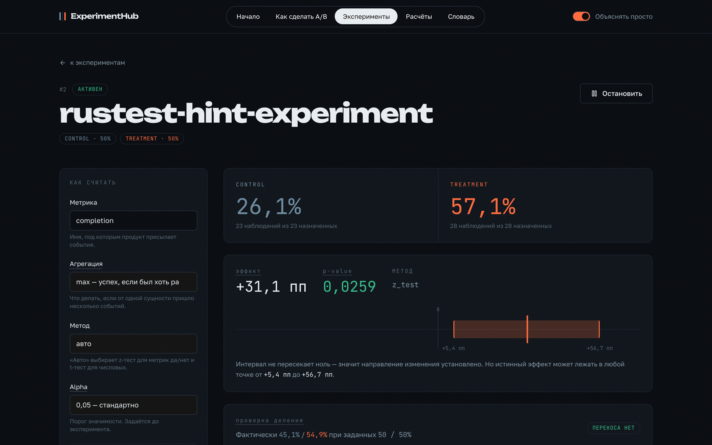
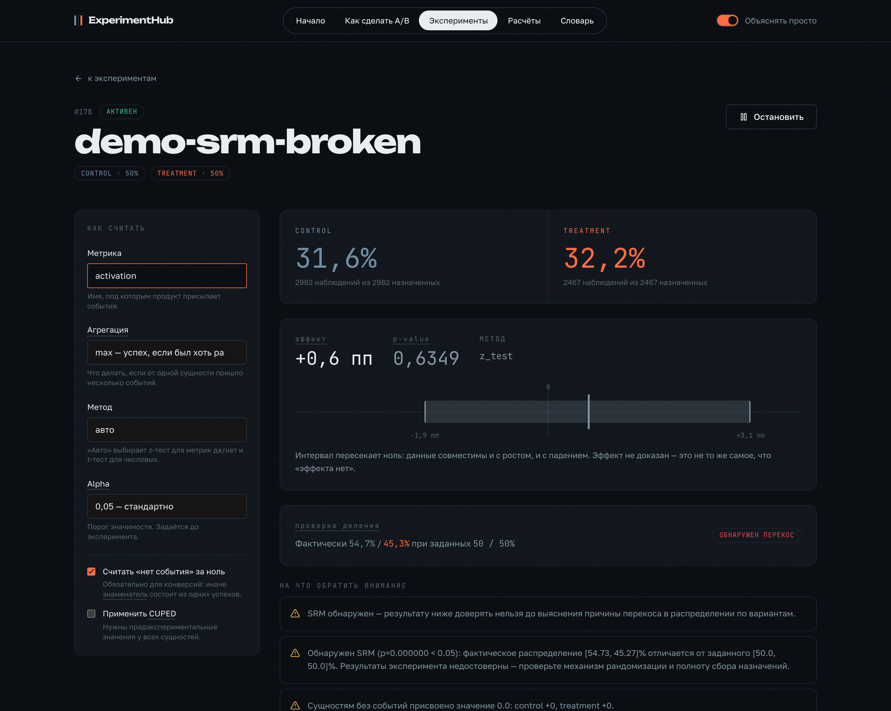
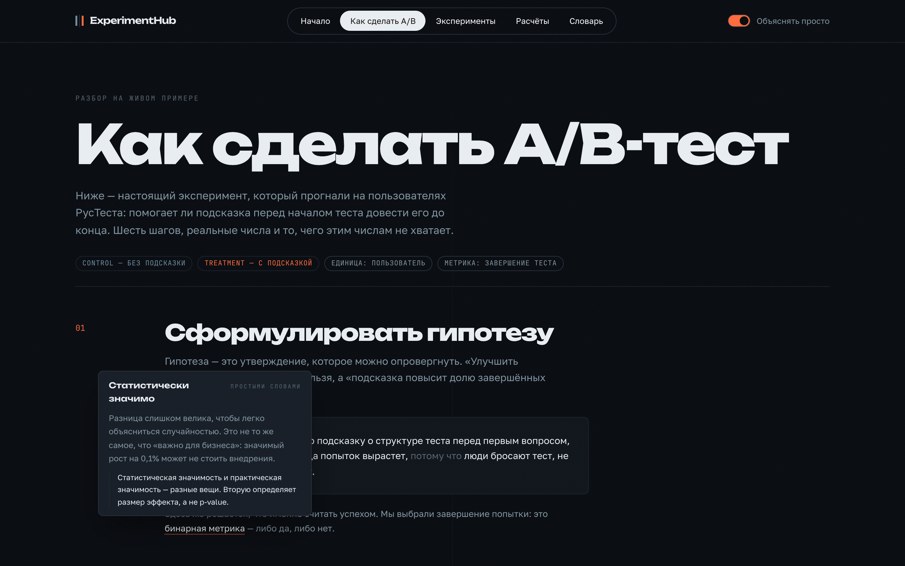
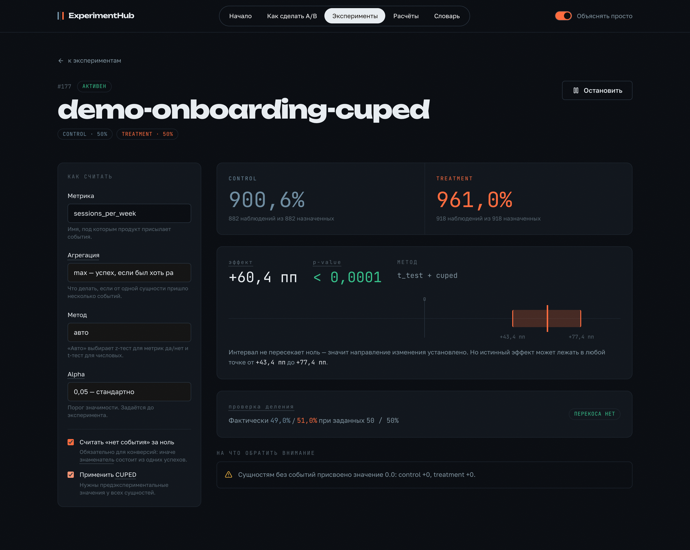

# ExperimentHub

**Продуктово-агностичная платформа A/B-тестирования и quasi-experimental анализа.**
Статистическое ядро написано и проверено самостоятельно: рандомизация, CUPED, bootstrap,
SRM-детекция, power analysis, поправки на множественность, DiD для сценариев без рандомизации.


|  |  |
|---|---|
| **Что делает** | делит аудиторию на варианты, принимает метрики, считает эффект и объясняет, можно ли ему верить |
| **Чем отличается** | не обёртка над `scipy.stats.ttest_ind` — статистика реализована и провалидирована симуляциями |
| **Универсальность** | `entity_id` и `metric_name` — свободные строки: один сервис обслуживает и пользователей LMS, и SKU маркетплейса |
| **Проверено на** | 2 подключённых продукта, 147 автотестов, симуляции на тысячах прогонов |



---

## Зачем

Большинство pet-проектов по экспериментам заканчиваются вызовом `ttest_ind`. Здесь
закрыт другой пробел: **как убедиться, что платформе можно доверять**, прежде чем
принимать по ней решения.

Ответ — AA-тестирование самой платформы, сверка с эталонными реализациями и
симуляции, измеряющие фактический уровень ошибки. Все числа ниже получены прогонами,
а не оценкой.

---

## Возможности

**Базовый слой** — hash-based детерминированная рандомизация · назначение вариантов ·
приём метрик с идемпотентностью · z-тест для долей · тест Уэлча для непрерывных ·
SRM-проверка

**Продвинутый слой** — CUPED со снижением дисперсии · bootstrap как непараметрическая
альтернатива · априорный расчёт выборки и апостериорная мощность · поправки
Бонферрони и Беньямини—Хохберга

**Quasi-experimental слой** — DiD для сценариев, где рандомизация невозможна ·
проверка допущения параллельных трендов · панельный режим по сущностям

---

## Архитектура

```
        РусТест (LMS)                                    SalesGuard (e-commerce)
   assignment по user_id                             DiD постфактум по sku
   метрика completion 0/1                            рандомизация невозможна
            │                                                    │
            └────────────────┐              ┌────────────────────┘
                             ▼              ▼
                    ┌──────────────────────────────┐
                    │        ExperimentHub         │
                    │                              │
                    │  routers/   experiments      │
                    │             assignment       │
                    │             events           │
                    │             results          │
                    │             quasi_experimental│
                    │             stats_tools      │
                    │                              │
                    │  stats/     randomization    │
                    │             frequentist      │
                    │             cuped            │
                    │             bootstrap        │
                    │             power_analysis   │
                    │             srm_check        │
                    │             multiple_testing │
                    │             quasi_experimental│
                    └──────────────┬───────────────┘
                                   ▼
                              PostgreSQL
```

**Ключевое решение.** Платформа не знает домена клиента. `entity_id` — произвольная
строка: `user-42`, `SKU-1180`, `store-7`. `metric_name` — тоже. Из-за этого один и тот
же расчёт обслуживает конверсию в тесте и дневную выручку товара, а слой `stats/`
остаётся чистыми функциями без БД и HTTP.

---

## Результаты прогонов

### Валидация самой платформы

| Проверка | Ожидалось | Измерено |
|---|---|---|
| AA-тест, z-критерий (10 000 прогонов) | 5,0% ложных | **5,06%** |
| AA-тест, тест Уэлча (10 000 прогонов) | 5,0% ложных | **4,99%** |
| Покрытие 95% bootstrap-интервала (300 прогонов) | 95% | **94,7%** |
| Мощность по расчёту выборки (1000 прогонов) | 80% | **78–82%** |
| Снижение дисперсии CUPED | ≈ rho² | **±5 пп при rho 0,3–0,9** |
| p-value против `scipy` / `statsmodels` | совпадение | **до 1e-5** |

### Реальный кейс: A/B на пользователях РусТеста

Гипотеза: подсказка о структуре теста перед первым вопросом увеличит долю
доведённых до конца попыток.

| | |
|---|---|
| control | 26,1% (6 из 23) |
| treatment | **57,1%** (16 из 28) |
| эффект | **+31,1 пп**, p = 0,026 |
| 95% интервал | [+5,4 пп, +56,7 пп] |
| SRM | не обнаружен |
| достигнутая мощность | 60,6% |

**Решение: направление подтверждено, величина — нет.** Интервал шириной 51 пункт и
мощность 60,6% означают, что выборку нужно добирать до 336 на вариант. Значимый
результат при такой мощности систематически завышает эффект.

### Quasi-experimental: DiD на данных SalesGuard

2000 SKU, 175 000 строк, 11 месяцев дневных продаж.

| Прогон | Результат |
|---|---|
| placebo — вмешательства не было | эффект не найден, p = 0,16 |
| synthetic +15% на 300 SKU | оценка +281 руб/день при истинных +334, p = 0,0004 |
| synthetic +15% на 20 SKU | не детектируется — нижний предел выборки |

Разрыв между оценкой и истиной (−54) в точности равен смещению, которое показал
placebo. DiD-оценка складывается из эффекта и расхождения групп; placebo измеряет
второе слагаемое напрямую.

---

## Методологические находки

Что нашло тестирование и почему это важно.

**CUPED вчетверо раздувал ошибку первого рода.** `theta` и центрирование считались
отдельно по control и treatment. Раздельное центрирование сохраняет сырую разницу
средних, но ужимает дисперсию на `rho²` — тест оценивает большую неопределённость
маленькой дисперсией. Измерено: **25,6% ложных срабатываний вместо 5%**; после
перехода на общую `theta` — **4,8%**.

**p-value и доверительный интервал описывали разные модели.** p-value брался у
Стьюдента, интервал строился по формуле Уэлча. На неравных дисперсиях это давало
p = 0,008 там, где Уэлч даёт p = 0,315 — ложноположительный вывод на ровном месте.

**Ключ хэширования склеивал `entity_id` и `experiment_id`** без разделителя:
пары `("1", 12)` и `("11", 2)` попадали в один бакет, назначения разных
экспериментов оказывались скоррелированы.

**Вырожденные данные роняли расчёт.** Нулевые и стопроцентные конверсии дают
`se = 0` и `nan`, который не сериализуется в JSON. Такие случаи — норма продакшена,
а не повод отдать 500: теперь они возвращают корректный ответ с предупреждением.

**Метрика без знаменателя.** Клиент слал событие только при успехе, поэтому
конверсия равнялась 100% в обеих группах независимо от варианта. Исправлено
отправкой нуля при входе в сценарий.

---

## Защита от типичных ошибок

Платформа не только считает, но и предупреждает о том, что делает вывод шатким.

**Подглядывание.** Симуляция ежедневных проверок с остановкой на первом `p < 0,05`:
**26,8% ложных «успехов» против 4,5%** при честной остановке. Эффект растёт с
частотой: 5 проверок дают 12,7%, 30 проверок — 29,3%.

**SRM.** Перекос в распределении обесценивает любой p-value, поэтому проверка идёт
до интерпретации эффекта и выносится в ответ первой.



**Множественные сравнения.** На 20 независимых метриках без поправки вероятность
хотя бы одного ложного открытия ≈ 64%, а не 5%.

---

## Интерфейс

Каждый статистический термин объясняется прямо в интерфейсе, в двух регистрах —
простыми словами и точно, — плюс типичная ошибка на этом термине.

 

Отдельная страница разбирает реальный A/B-тест РусТеста по шагам: гипотеза →
дизайн → размер выборки → сбор → результат → решение.

---

## Быстрый старт

```bash
git clone https://github.com/kuznetsovskdh/experimenthub && cd experimenthub
docker network create eh_network
docker compose up --build
```

| | |
|---|---|
| интерфейс | http://localhost:3002 |
| документация API | http://localhost:8001/docs |
| проверка живости | http://localhost:8001/health |

Минимальный сценарий за минуту:

```bash
# создать эксперимент
curl -s -X POST localhost:8001/experiments/ -H 'Content-Type: application/json' -d '{
  "name":"quickstart","entity_type":"user",
  "variants":[{"name":"control","allocation_pct":50},{"name":"treatment","allocation_pct":50}]}'

# получить вариант (повторный вызов вернёт тот же)
curl -s "localhost:8001/experiments/1/assignment?entity_id=user-1"

# метрика: ноль при входе в сценарий, единица при успехе
curl -s -X POST localhost:8001/experiments/1/events -H 'Content-Type: application/json' \
  -d '{"entity_id":"user-1","metric_name":"conversion","metric_value":1.0,"event_key":"u1-done"}'

# результат
curl -s "localhost:8001/experiments/1/results?metric_name=conversion&fill_missing=0"
```

Подключение своего продукта — [docs/INTEGRATION.md](docs/INTEGRATION.md).
Ручная проверка сервиса — [docs/TESTING.md](docs/TESTING.md).

---

## Структура

```
app/
  models.py                 Experiment · Variant · Assignment · Event · Result
  routers/                  experiments · assignment · events · results
                            quasi_experimental · stats_tools
  stats/
    randomization.py        детерминированное бакетирование по хэшу
    frequentist.py          z-тест долей, тест Уэлча, доверительные интервалы
    cuped.py                снижение дисперсии по предэкспериментальной метрике
    bootstrap.py            перцентильный bootstrap
    power_analysis.py       размер выборки и достигнутая мощность
    srm_check.py            хи-квадрат на перекос распределения
    multiple_testing.py     Бонферрони, Беньямини—Хохберг
    quasi_experimental.py   DiD и проверка параллельных трендов
frontend/                   React 18 · TypeScript · Tailwind · Vite
tests/                      12 блоков: рандомизация, AA, SRM, частотные тесты,
                            CUPED, bootstrap, мощность, DiD, события,
                            множественность, peeking, сквозной пайплайн
clients/                    примеры интеграции: rustest_client, salesguard_client
```

Тесты сгруппированы по проверяемому свойству, а не по файлам кода:

```bash
docker compose exec app python -m pytest -q          # 147 тестов
cd frontend && npm run test:ui                       # 58 проверок интерфейса
```

---

## Ограничения

- **Sequential testing не реализован.** Платформа измеряет вред подглядывания и
  предупреждает о нём, но технически не мешает — размер выборки считается заранее.
- **Bayesian-подход сознательно не делался.** Частотный выбран как стандартный
  для индустрии и собеседований.
- **Параллельные тренды в DiD** проверяются, но прохождение проверки не является
  доказательством применимости метода — ответственность на аналитике.
- **`/results` сравнивает ровно два варианта.** Многорукий эксперимент — попарно
  с поправкой на множественность.
- **Реальной размеченной акции в данных SalesGuard нет**, поэтому DiD подтверждён
  на настоящих рядах, но бизнес-результата по акции пока не существует.

## Дальше

Sequential testing · Bayesian A/B как альтернативный подход · multi-armed bandit
(низкий приоритет)

---

## Связанные проекты

**[РусТест](https://github.com/kuznetsovskdh/rustest)** — платформа тестирования по
русскому языку. Использует ExperimentHub для классического A/B: запрашивает вариант
по `user_id` при старте попытки, присылает метрику `completion` при завершении.

**[SalesGuard](https://github.com/kuznetsovskdh/Salesguard)** — аналитика продаж для
маркетплейсов. Использует ExperimentHub для DiD-оценки акций: рандомизация по SKU
физически невозможна, поэтому эффект считается постфактум по временным рядам.

---

**Илья Кузнецов** · [github.com/kuznetsovskdh](https://github.com/kuznetsovskdh)
